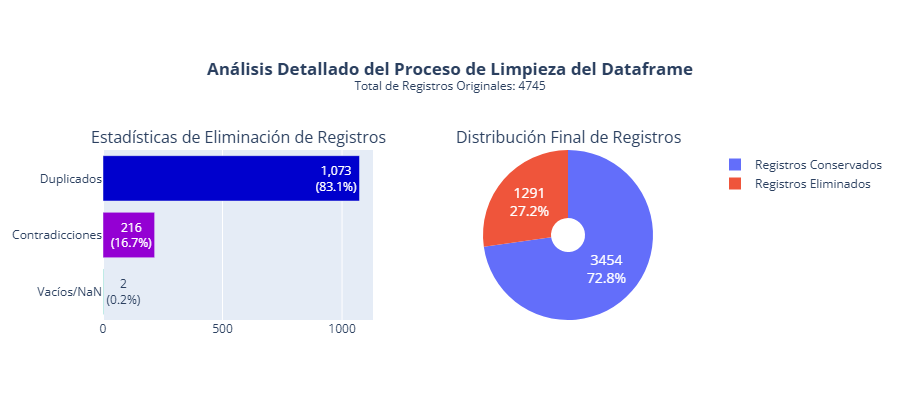
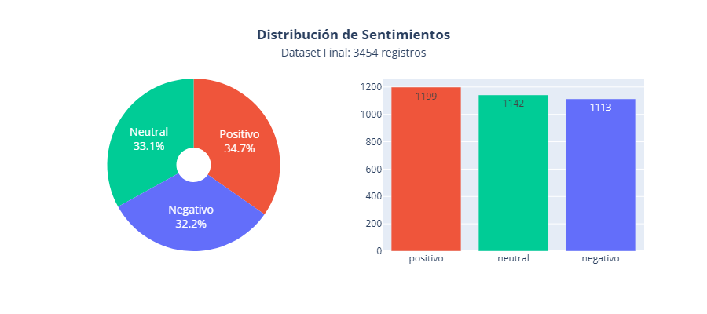

# SentimentAPI  🥲

---

⚠️  **Nota importante** : Este repositorio **no incluye** el código del microservicio (API, despliegue, machine learning ,etc.) ni el trabajo del resto del equipo. Es únicamente una muestra de mis capacidades como especialista en procesamiento de datos y documentación técnica, pensado para que reclutadores y aprendices puedan evaluar mi enfoque, calidad de código y toma de decisiones.
Dentro de las restricciones del proyecto, era utilizar **un único notebook** para todo el proceso de preparación de datos, lo que me llevó a diseñar un pipeline modular y escalable dentro de ese formato, con funciones reutilizables y una estructura clara. El código está documentado con comentarios detallados y cada decisión de diseño está justificada en el contexto del proyecto.

**Proyecto Original** :[ https://github.com/ml-punto-tech/sentiment-api](https://github.com/ml-punto-tech/sentiment-api)


**App:**  **[https://sentiment-ceron.vercel.app/](https://sentiment-ceron.vercel.app/)**

---

  **Hackathon ONE | Equipo Data Science**

## 📑 Contenido

- [Contexto SentimentAPI](#-contexto-del-proyecto-sentimentapi)
- [Rol Analytics Engineer](#-rol-en-el-equipo)
- [Stack tecnológico](#stack-tecnológico)
- [Estructura de archivos](#estructura-de-archivos)
- [Descripción del notebook](#-descripción-notebook-sentimentapi)
- [Detalles técnicos](#-detalles-técnicos-destacados-de-mi-implementación)
- [Desafíos y soluciones](#-desafíos-identificados-y-soluciones-implementadas)
- [Instalación y uso](#-instalación-y-uso)
- [Contacto](#-contacto)

> [](https://www.python.org/downloads/)[](https://opensource.org/licenses/MIT)[](https://nocountry.tech/hackathon-one-ii-latam/cmj15mkcy001joy014aszb3z5)[](https://credsverse.com/credentials/0b4822a8-4e38-4eba-982b-0c8501ed623b)
>
> ---
>
> ## 📌 Contexto del Proyecto: SentimentAPI
>
>
> ### 📊 SentimentAPI: Proyecto Destacado (Hackathon No Country)
>
> Este proyecto fue desarrollado durante la  **Hackathon One II LATAM** , integrando análisis de sentimientos con una arquitectura de datos moderna.
>
> * **🌐 Aplicación Web:** [sentiment-ceron.vercel.app](https://sentiment-ceron.vercel.app/) — *Interfaz interactiva para análisis en tiempo real.*
> * **📂 Repositorio:** [github.com/ml-punto-tech/sentiment-api](https://github.com/ml-punto-tech/sentiment-api) — *Arquitectura, API y lógica de procesamiento.*
> * **🏆 Showcase Oficial:** [Ficha del Proyecto en No Country](https://nocountry.tech/hackathon-one-ii-latam/cmj15mkcy001joy014aszb3z5) — *Video demo y detalles de la competencia.*

Este repositorio es un **espejo de mi contribución individual** al proyecto `SentimentAPI`, desarrollado en el marco de un **hackathon** por un equipo de  **8 personas** .

`SentimentAPI` es un **microservicio inteligente** que expone una API REST capaz de recibir feedback de usuarios (reseñas, comentarios, encuestas, etc.) y devolver una **predicción de sentimiento** (positivo, negativo, neutral) en tiempo real. El objetivo del proyecto era construir una solución completa, desde la ingesta de datos hasta el despliegue del modelo.

![Proceso SentimentAPI: Flujo completo desde preparación de datos hasta modelo entrenado. Fase 1 muestra 4,745 registros crudos siendo filtrados a 3,454 limpios, con 27.2% eliminados por duplicados, contradicciones y valores nulos. Fase 2 presenta el entrenamiento con balanceo SMOTE, generación de datos sintéticos, modelo SVM Vieja Confiable con precisión final del 82.8%, y tabla de rendimiento mostrando métricas por clase: Precisión entre 0.82-0.84, F1-Score entre 0.81-0.85 para sentimientos negativo, neutral y positivo](images/README/proceso_sentiment_api.png)

---

### 🧠 Pipeline de Análisis de Sentimientos

> **Título**: **SentimentAPI** 🥲
> **Notebook**: `Modelo_SentimentAPI.ipynb`
> **Autor**: [Marely Cárcamo Quisto](https://www.linkedin.com/in/marely/)
> **Rol**: Analytics Engineer (Data Preparation & Cleaning)
> **Propósito**: Procesar, limpiar y unificar múltiples datasets de sentimientos en español, transformándolos en un dataset de alta calidad listo para modelos de Machine Learning.
> **Licencia**: MIT License
> **Fecha de creación**: enero 2026

---

### Stack Tecnológico

[](https://www.python.org/downloads/)[](https://pandas.pydata.org/)[](https://matplotlib.org/)[](https://plotly.com/python/)[](https://chardet.readthedocs.io/)[](https://docs.python.org/3/library/unicodedata.html)[](https://docs.python.org/3/library/warnings.html)

---

### 🧩 Rol en el equipo

Rol en el equipo: **Analytics Engineer**, responsable de la **preparación y limpieza de datos** para entrenar el modelo de clasificación de sentimientos. Mi trabajo se centró en:

* **Procesamiento de 3 datasets heterogéneos** (diferentes formatos, codificaciones y niveles de granularidad).
* **Pipeline de limpieza, normalización y categorización** de sentimientos en español.
* **Generación de un dataset unificado y balanceado** , listo para entrenar el modelo de clasificación que usaría el microservicio.

### Origen de Datos

Con el objetivo de mejorar la capacidad de generalización del modelo, se trabajó con dos datasets independientes obtenidos desde Kaggle. Si bien ambos conjuntos de datos abordan el análisis de sentimiento en español, presentan diferencias en estructura,calidad lingüística y formato de origen. Su integración permitió ampliar la diversidad de expresiones textuales, reduciendo el sesgo hacia un único estilo de redacción y fortaleciendo la robustez del pipeline de preparación de datos en escenarios similares a producción.

---

### Estructura de Archivos

```
Sentiment-API-Refactor
│
├── .gitignore
├── README.md
├── requirements.txt
├── run.py
├── Makefile
│ 
├── /images
│     └── /README
│          ├── proceso_sentiment_api.png
│          ├── preparacion_limpieza_datos.png
│          ├── eliminacion_registros.png
│          └── distribucion_sentimientos.png
│
└── /data-science
     │
     ├── /notebooks
     │     └── Modelo_SentimentAPI.ipynb   # Pipeline completo de preparación y limpieza.
     │
     ├── /datasets
     │     ├── dataset_listo_para_ML.csv
     │     │
     │     └── /datasets-origin           # Punto de montaje para las URLs
     │          ├── dataset1.csv
     │          ├── dataset2.csv
     │          └── dataset3.csv
     │
     └── /source
           └── /diccionarios
                ├── sentimientos_mapeo.json    # Mapeo de 106 sentimientos a 3 categorías
                ├── sentimientos_negativos.txt
                ├── sentimientos-neutros.txt
                └── sentimientos_positivos.txt  


```

## 📌 Descripción Notebook SentimentAPI

Este notebook implementa un **pipeline de datos completo** para análisis de sentimientos en español.
Toma **tres datasets crudos** con diferentes estructuras, codificaciones y niveles de granularidad, y los convierte en un único conjunto de datos **balanceado, sin contradicciones y con sentimientos normalizados** (positivo / negativo / neutral).

El pipeline está diseñado para ser **escalable**, **modular** y **reproducible** – añadir un nuevo dataset solo requiere una línea en un diccionario de configuración.


---

### 🔧 Detalles técnicos destacados de mi implementación

A continuación se describen las decisiones de diseño y las técnicas implementadas en el notebook, pensadas para garantizar trazabilidad, escalabilidad y calidad del dato.

#### ✨ 1. Arquitectura modular y escalable con procesar_dic()

Función genérica `procesar_dic()` que aplica cualquier función de transformación a todos los DataFrames almacenados en un diccionario.

Esto permite añadir nuevos datasets simplemente agregando una entrada al diccionario datasets, sin modificar el resto del pipeline.

Cada etapa (carga, filtrado, limpieza) genera un nuevo diccionario con sufijos consistentes (_cargado, _filtrado, _limpio), evitando inconsistencias y sobrescrituras accidentales.

```
def procesar_dic(dict, funcion_proceso, sufijo=''):
    nuevo_dict = {}

    for nombre, item in dict.items():
        # Extraer partes del nombre
        partes = nombre.split('_')

        if len(partes) >= 2:
            nombre_base = partes[0]          # 'df1'

            # Aplicar función de procesamiento
            df_proc = funcion_proceso(item, nombre)

            # Crear nuevo nombre
            nuevo_nombre = f"{nombre_base}{sufijo}"
            nuevo_dict[nuevo_nombre] = df_proc

            print(f"✅ {nombre} → {nuevo_nombre}")
            print('-' * 80)

    return nuevo_dict
```

#### ✨2. Trazabilidad total mediante acumuladores y variables globales

Implementé un sistema de contadores acumulativos (CONTADOR_GLOBAL) que registra, paso a paso, el número de registros eliminados por:

- Contradicciones semánticas (mismo texto con distinto sentimiento)
- Duplicados exactos (mismo texto + mismo sentimiento)
- Valores nulos o vacíos
- Estos acumuladores se actualizan en cada fase y al final alimentan un gráfico interactivo (Plotly) que muestra de forma visual el impacto de cada criterio de limpieza.
- La lógica está encapsulada en la función limpieza_dataframe_unificado(), que además adjunta las estadísticas como atributo del DataFrame (df.estadisticas_limpieza), facilitando su reutilización y auditoría.

#### ✨3. Clasificación inteligente con diccionario externo

Los datasets originales tenían una granularidad excesiva: hasta 105 sentimientos distintos (ej. "admiración", "asombro", "adoración").

Para reducir la dimensionalidad y facilitar el aprendizaje supervisado, cargué un diccionario externo de 106 términos (descargado desde GitHub) que mapea cada sentimiento específico a una de tres categorías: positivo, negativo o neutral.

La función categorizar_sentimiento() aplica este mapeo de forma eficiente y tolerante a mayúsculas/minúsculas.

```
def categorizar_sentimiento(sentimiento, categorias, nombres=('positivo', 'negativo', 'neutral')):

    """
    Versión flexible que permite nombres personalizados para las categorías.
    """
    if pd.isna(sentimiento):
        return None
  
    sent = str(sentimiento).strip().lower()
  
    # Iterar sobre cada categoría
    for i, lista_categoria in enumerate(categorias):
        if sent in lista_categoria:
            return nombres[i]

    return None
```

#### ✨4. Limpieza de texto robusta para el español

La función limpiar_texto_sentimientos() realiza una normalización Unicode (NFD) para eliminar tildes, pero preserva la letra ñ mediante un sistema de marcadores temporales – algo crítico en español para no perder significado.

También se eliminan hashtags, URLs rotas, caracteres no imprimibles y se normalizan espacios múltiples.

Se mantiene la mayúsculas iniciales para no perder posibles señales emocionales (ej. "FELIZ" vs "feliz").

#### ✨5. Detección automática de encoding y manejo de errores de red

Cada dataset se descarga desde una URL pública. La función importar_dataset() utiliza chardet para detectar automáticamente el encoding (UTF-8, Windows-1252, ISO-8859-15, etc.), evitando caracteres corruptos.

Incluye reintentos con separadores alternativos (, , ; , \t) si el especificado falla.

Captura excepciones HTTPError y URLError para informar fallos sin detener todo el pipeline.

#### ✨6. Eliminación de contradicciones semánticas (decisión fundamentada)

Detecté que algunos textos aparecían etiquetados con diferentes sentimientos en distintos registros (ej. la misma frase marcada como positivo y negativo).

Decisión: eliminé todos los registros de esos textos contradictorios (216 casos), porque entrenar con ellos introduciría ruido insalvable.
Justificación documentada en el notebook.

#### ✨7. Visualización interactiva para comunicación de resultados

##### Visualización de impacto de limpieza

Utilización de `plotly.graph_objects` y `make_subplots` para generar un dashboard de dos paneles:

- Barras horizontales que desglosan las causas de eliminación.
- Gráfico circular que muestra la proporción final de registros conservados vs. eliminados.

Los datos aquí mostrados son resultado del proceso de limpieza, mediante el uso de los contadores acumulativos implementados en el código, que permiten cuantificar el impacto de cada criterio de limpieza y comunicarlo de forma visual a stakeholders o reclutadores.



##### Visualización de distribución de sentimientos

La distribución final de sentimientos se presenta también con un gráfico combinado (pie + barras), evidenciando el balance logrado (≈34% cada clase).
Los datos aquí representados provienen del dataset final limpio, mostrando la proporción de registros clasificados como positivo, negativo y neutral después de aplicar el diccionario de mapeo y la limpieza de texto.



💡 Estas decisiones reflejan mi enfoque en código mantenible, auditoría de datos, escalabilidad y comunicación visual de resultados – cualidades que considero fundamentales en entornos colaborativos y de producción.

---

### 🔍 Desafíos Identificados y Soluciones Implementadas

#### 1️⃣ 🌍  Desafío: Datasets en inglés requieren traducción al español.

**Contexto:** Dataset1 y Dataset3 originalmente en inglés

**Problema:** Modelo final necesita consistencia lingüística en español
**Riesgo:** Mezcla de idiomas introduce ruido en embeddings y clasificación

##### ✅ **Solución: Proceso de Traducciòn de dos Fases**

**Fase 1 - Automatización:**

APIs de traducción (Google Translate, DeepL)
Procesamiento batch para escalabilidad

**Fase 2 - Revisión manual:**

Hablantes nativos corrigen matices emocionales
Excel para revisión colaborativa
Corrección de falsos amigos y expresiones idiomáticas

📊 **Justificación:**
Ejemplo crítico:
'This is sick!'   →   '¡Esto es increíble!'  (no literal)
Traducción palabra-por-palabra pierde polaridad emocional
Inversión en traducción paga en calidad final del dataset

---

##### 2️⃣ 🔠 **Desafío: Inconsistencias de encoding entre datasets.**

**Contexto:** Cada dataset con encoding diferente (UTF-8, Windows-1252, etc.)
**Problema:** Caracteres corruptos (􀄬), tildes perdidas, 'ñ' dañada
**Riesgo:** Pérdida de significado y ruido en procesamiento NLP

##### ✅ **Solución: Detección automática y normalización unificada.**

**Herramienta:** chardet para detección automática de encoding
**Proceso:** normalizar_texto() con manejo específico de caracteres españoles
**Preservación:** Mantener 'ñ' y eliminar tildes inteligentemente
**Validación:** Verificar que 'niño' → 'niño' (no 'nino' )

📊 **Justificación:**

- Encoding incorrecto corrompe análisis léxico 'cañón' ≠ 'canon' (significados completamente diferentes)
- Normalización consistente esencial para modelos basados en tokens

---

##### 3️⃣ 🎓 Desafío: Características que sugieren material de entrenamiento

**Observación:** Patrones repetitivos y estructuras didácticas
**Dataset2:** Contradicciones intencionales (mismo texto, diferente etiqueta)
**Dataset3:** Variaciones lingüísticas pedagógicas (6 formas de decir lo mismo)
**Riesgo:** Dataset no representa distribución real del lenguaje

##### ✅ Solución: Análisis y limpieza adaptativa por patrón.

**Para contradicciones (Dataset2):** Eliminación completa (216 registros)
**Para variaciones (Dataset3):** Conservación con documentación
**Análisis:** Identificar clusters temáticos (ej: 'Borderlands murder')
**Documentación:** Registrar patrones encontrados para transparencia

📊 **Justificación:**
**Contradicciones:** Mejor eliminar que entrenar con etiquetas incorrectas
**Variaciones:** Conservar como ejemplos de equivalencia semántica
**Transparencia:** Documentar hallazgos para usuarios futuros

---

##### 4️⃣ 🏷️ Desafío: Granularidad fina en sentimientos (Dataset1)

**Contexto:** Dataset1 tiene 105 sentimientos específicos
**Ejemplos:** 'admiración','asombro','respeto','adoración'

**Problema:** Demasiadas clases para clasificación efectiva
**Riesgo:** Overfitting y dificultad en generalización

##### ✅ **Solución: Diccionario de mapeo a 3 categorías principales**

**Fuente:** Diccionario externo con 106 sentimientos mapeados
**Categorías:** positivo,negativo,neutral
**Proceso:** categorizar_sentimiento() con búsqueda en diccionario
**Validación:** Verificar mapeos controvertidos manualmente

📊 **Justificación:**

- 105 clases → 3 clases:** Reducción dimensional manejable
- **Diccionario externo:** Aprovecha trabajo curado existente
- **Consistencia:** Mismo mapeo para 'admiración' y 'asombro' → 'positivo'

---

##### 5️⃣ 💬 Desafío: Dialecto de redes sociales y lenguaje informal

**Contexto**: Textos de Twitter, comentarios, mensajes informales
**Características:** Abreviaciones, emoticonos, hashtags, lenguaje coloquial
**Ejemplos:** 'xq' , 'tb' , 'q' , '???', 'lol', hashtags emocionales
**Riesgo:** Procesamiento literal pierde significado emocional

##### ✅ Solución: Limpieza inteligente que preserva intención emocional

* **Hashtags:** Extraer contenido emocional (#FelizViernes → 'Feliz Viernes')
* **Emoticonos:** Mapear a sentimientos (:) → positivo, :( → negativo)
* **Abreviaciones:** Expandir conservando tono ('xq' → 'porque')
* **Puntuación emocional:** '???', '!!!' como indicadores de intensidad

**📊 Justificación:**
'Te amo ❤️' ≠ 'Te amo' (emoticono añade intensidad)
'#Estresado' contiene señal emocional en el hashtag
Lenguaje informal es datos válidos, no ruido a eliminar

---

##### 6️⃣ 🏗️ Desafío: Trabajo colaborativo requiere estructuras claras.

- **Contexto:** Equipo de 4 personas trabajando en mismo código
- **Problemas:** Conflictos de Git, inconsistencias, código duplicado
- **Necesidad:** Pipeline que scale de 3 a N datasets sin reescribir

##### ✅ Solución: Arquitectura basada en diccionarios y funciones modulares

**Configuración:** Diccionarios definen datasets y parámetros
**Pipeline:** procesar_dic() aplica cualquier función a todos los datasets
**Modularidad:** Funciones pequeñas con responsabilidad única
**Nomenclatura:** Sufijos consistentes (_cargado, _filtrado, _limpio)

📊 **Justificación:**

- De 3 a 30 datasets: Solo agregar entrada al diccionario
- Colaboración: Estructura clara reduce conflictos de merge
- Mantenibilidad: Cambios en un solo lugar (principio DRY)

---

#### 📈 Impacto de las Soluciones Implementadas

### Calidad del dataset final:

- **3,454 registros** perfectamente balanceados
- **0 contradicciones**, 0 duplicados exactos
- **Distribución:** 34.7% positivo, 33.1% neutral, 32.2% negativo

### Escalabilidad demostrada:

- Pipeline procesa **N datasets** sin cambios estructurales
- Código **80% más corto** que solución ad-hoc equivalente
- Fácil de extender por nuevos miembros del equipo

### Decisiones documentadas:

- Cada desafío → solución → justificación registrada
- Transparencia en trade-offs (ej: eliminar 27% de datos)
- Base para iteraciones futuras y mejoras continuas

### Valor para la producción:

- Dataset listo para entrenar modelos de ML
- Pipeline reusable para nuevos proyectos de análisis de sentimientos
- Metodología transferible a otros dominios de NLP

---

## 🏆 **Conclusión de desafíos técnicos a soluciones sistemáticas**

Cada desafío encontrado no fue tratado como un problema aislado, sino como una oportunidad para diseñar **soluciones sistémicas** que:

1. **RESUELVEN** el problema inmediato
2. **ESCALAN** para problemas futuros similares
3. **DOCUMENTAN** el razonamiento para transparencia
4. **CREAN** valor más allá del proyecto específico

---

##### "Mi enfoque no se limita a procesar información; transformo datos crudos en activos estratégicos mediante soluciones sistémicas, asegurando que la tecnología sea siempre el motor, y nunca el obstáculo, del crecimiento organizacional."

---

## 📣 Instalación y Uso

Sigue estas instrucciones y en pocos minutos obtendrás el dataset limpio y balanceado, listo para entrenar modelos de Machine Learning.
🔗 [Enlace al repositorio](https://github.com/marelycarcamo/SentimentAPI-refactor.git)

Sigue estos pasos para ejecutar el proyecto en local.

### Requisitos Previos

- Python 3.12 o superior instalado.
- Git (opcional, para clonar el repositorio).
- Conexión a internet (para descargar dependencias y datos simulados desde GitHub).

### 1. Clonar Repositorio

```
git clone https://github.com/marelycarcamo/SentimentAPI-refactor.git
cd SentimentAPI-refactor

```

### 2. Crear Entorno Virtual e Instalar Dependencias

Windows

```
python -m venv venv
venv\Scripts\activate
```

Linux/Mac

```
python3 -m venv venv
source venv/bin/activate
```

### 3. Instalar dependencias

```
pip install -r requirements.txt
```

Si no tienes el archivo requirements.txt, instala manualmente los paquetes principales:

```
pip install pandas plotly jupyter
```

### 4. Ejecutar el Notebook Modelo_SentimentAPI.ipynb

Desde la raíz del proyecto, lanza Jupyter Lab o Notebook:

```
jupyter notebook
```

Abre el notebook `Modelo_SentimentAPI.ipynb` y ejecuta todas las celdas para procesar los datos y generar el dataset final listo para modelado.

### Ejecución automática (sin abrir Jupyter)

Puedes ejecutar todo el pipeline de limpieza directamente desde la terminal:

```
# Opción 1: Usando Python
python run.py

# Opción 2: Usando Make (si lo tienes instalado)
make run

```

---

## 📣 Contacto

Si deseas contactarme para discutir este proyecto, oportunidades laborales o colaboraciones, no dudes en enviarme un mensaje a través de LinkedIn:

[](https://www.linkedin.com/in/marely/)[](https://nocountry.tech/hackathon-one-ii-latam/cmj15mkcy001joy014aszb3z5)[](https://credsverse.com/credentials/0b4822a8-4e38-4eba-982b-0c8501ed623b)

**Enero 2026**
